## Welcome to my profile, I'm Ataberk

I'm a **Computer Engineering student at TOBB University of Economics and Technology (TOBB ETÜ)**, currently developing my skills in software engineering, full-stack development, and emerging technologies. With a strong academic foundation and hands-on experience in both academic and real-world projects, I am passionate about building efficient, scalable, and user-centered software solutions.

---

### Experience

- **Internship**  
  **ICterra Information and Communication Technologies**  
  *January 2025 - April 2025*  
  *Contributed to the development and maintenance of enterprise-level software projects with a focus on quality, maintainability, and collaboration.*
  
- **Internship**  
  **Nurol Makina**  
  *January 2026 -*  
  *Learning modern enterprise management via SAP ERP and debugging using ABAP language on the IT department. Contributing to side projects from other departments using Python to develop in-house software for future use.*

---

### Education

- **B.Sc. in Computer Engineering**  
  TOBB University of Economics and Technology (on-going)

---

### Technical Skills

- **Languages**: Java, Python, C/C++, JavaScript, Verilog, MATLAB, ABAP
- **Technologies**: Spring Boot, React, Node.js, Git, Docker, SAP ERP
- **Databases**: MySQL, MongoDB, PostgreSQL, SAP HANA
- **Tools**: IntelliJ, VS Code, Postman, GitHub, Vivado, MATLAB Editor, SAP GUI

---

### GitHub Stats

---

### Interests

Outside of engineering, I enjoy playing chess, watching Twitch streams, listening to music, and exploring indie games. I also enjoy working on personal small projects in my free time.

---

### Connect with me

- [LinkedIn](https://www.linkedin.com/in/ataberktekin/)  
- [Twitter](https://x.com/ataberk_tekin)

