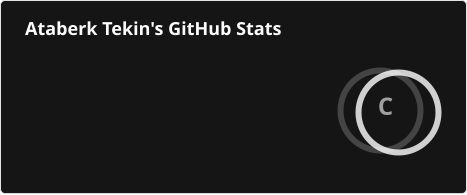
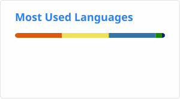

## Welcome to my profile, I'm Ataberk

I'm a **Computer Engineering student at TOBB University of Economics and Technology (TOBB ETÜ)**, currently developing my skills in software engineering, full-stack development, and emerging technologies. With a strong academic foundation and hands-on experience in both academic and real-world projects, I am passionate about building efficient, scalable, and user-centered software solutions.

---

### Experience

- **Part-time Software Developer**  
  **Nurol Makina**  
  *May 2026 - Present*  
  *Currently continuing to take part in 'in house' software development and is ready for future project development on demand.*

- **Internship**  
  **Nurol Makina**  
  *January 2026 - April 2026*  
  *Learned modern enterprise management through SAP ERP and took part in debugging using the ABAP language in the IT department. Contributed to side projects from other departments using Python to develop in-house software for future use.*

- **Internship**  
  **ICterra Information and Communication Technologies**  
  *January 2025 - April 2025*  
  *Contributed to the development and maintenance of enterprise-level software projects with a focus on quality, maintainability, and collaboration.*
  

---

### Education

- **B.Sc. in Computer Engineering**  
  TOBB University of Economics and Technology (on-going)

---

### Technical Skills

- **Languages**: Java, Python, C/C++, JavaScript, Verilog, MATLAB, ABAP
- **Technologies**: Spring Boot, React, Node.js, Git, Docker, SAP ERP
- **Databases**: MySQL, MongoDB, PostgreSQL, SAP HANA
- **Tools**: IntelliJ, VS Code, Postman, GitHub, Vivado, MATLAB Editor, SAP GUI

---

### GitHub Stats

  
  

---

### Interests

Outside of engineering, I enjoy playing chess, watching Twitch streams, listening to music, and exploring indie games. I also enjoy working on personal small projects in my free time.

---

### Connect with me

- [LinkedIn](https://www.linkedin.com/in/ataberktekin/)  
- [Twitter](https://x.com/ataberk_tekin)

